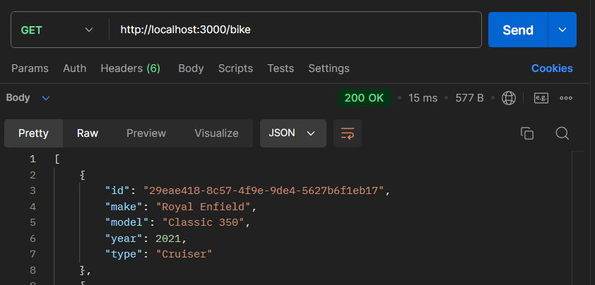
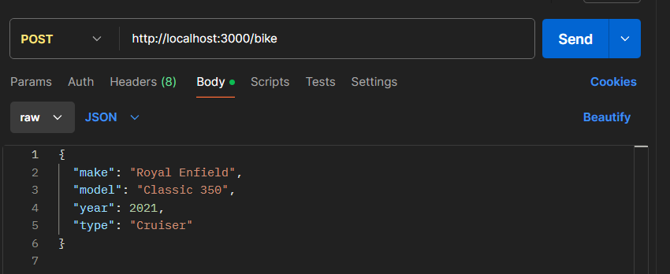

# ️ Bike Library API

A simple REST API built using **Nest.js** for managing a bike library. The API supports **CRUD operations** (Create, Read, Update, Delete) for bike entries and is connected to an **SQLite** database.

---
# 📦 Installation:
To set up the project on your local machine, follow these steps:
### Prerequisites &#8658;
Make sure you have the following installed:
- [**Node.js**](https://nodejs.org/en/) (v16.x or later)
- [**npm**](https://www.npmjs.com/) (comes with Node.js)
- [**SQLite**](https://www.sqlite.org/download.html)
### Steps &#8658;
1. **Clone the Repository**:
   ```bash
   git clone https://github.com/yourusername/bike-library-api.git
   cd bike-library-api
2. **Install Dependencies**:
   ```bash
   npm install
3. **Create the SQLite database**:
   The SQLite database file will be automatically created when the application runs for the first time.
4. **Running the Application**:
   ```bash
   npm run start
5. **Swagger Documentation**:
   URL: http://localhost:3000/api
---
# 📝 Technologies used:

- [**Nest.js**](https://nestjs.com/)
- [**SQLite**](https://www.sqlite.org/index.html) (Database)
- [**TypeORM**](https://typeorm.io/) (ORM for managing SQLite)
- [**Swagger**](https://swagger.io/) (API Documentation)
- [**Docker**](https://swagger.io/) (Docker and Docker-compose file)

---

# ✨ Features

- **CRUD Operations**: Manage bike entries with endpoints for creating, reading, updating, and deleting bikes.
- **SQLite Database**: Stores bike information persistently.
- **DTO Validation**: Ensures valid input for creating and updating bike entries.
- **Graceful Error Handling**: Handles invalid and non-existent bike IDs with proper error messages.
- **Swagger Documentation**: Provides API documentation and an interactive interface.

---
# 🧪 Testing with Postman
- **GET**: http://localhost:3000/bike  -> Fetch all bikes
- **POST**: http://localhost:3000/bike  -> Add a new bike
- **PATCH**: http://localhost:3000/bike/:id  -> Update an existing bike
- **DELETE**: http://localhost:3000/bike/:id  -> Delete a bike

### Postman Screenshots =>
<div style="display: flex; justify-content: space-around;">
  
  
</div>
<div style="display: flex; justify-content: space-around;">
  
  
</div>
---


